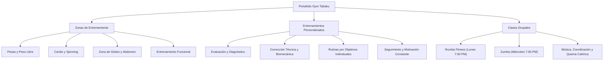
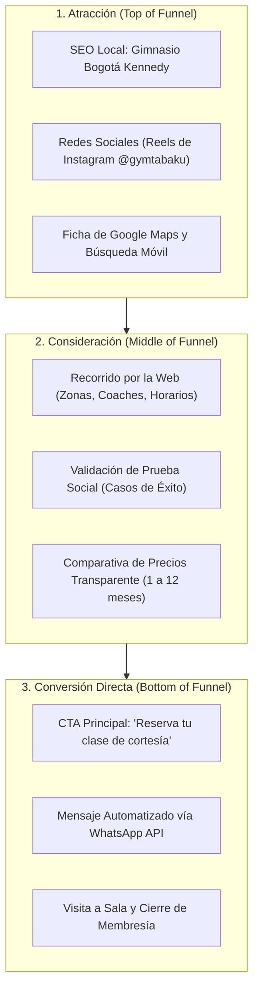

# Estrategia de Negocio y Contexto Operativo — Gym Tabaku

Documento estratégico integral que consolida el modelo de negocio, la propuesta de valor, el catálogo de servicios, la estructura de membresías, el perfil del equipo, el público objetivo y la estrategia digital de **Gym Tabaku** ([https://gymtabaku.com](https://gymtabaku.com)).

Este documento extrae, sintetiza y alinea la información de los contratos de datos en `src/components/constants/` (`site.ts`, `services.ts`, `pricing.ts`, `coaches.ts`, `schedules.ts`, `testimonials.ts`, `social.ts`, `navigation.ts`) con el contenido real de la plataforma.

---

## 1. Identidad de Marca y Filosofía Empresarial

### 1.1. Manifiesto y Concepto

Gym Tabaku es un centro de acondicionamiento físico y bienestar ubicado en la localidad de **Kennedy, Bogotá**. A diferencia de las cadenas impersonales de bajo costo, Gym Tabaku se posiciona bajo el principio de **cercanía, acompañamiento y comunidad**:

> _"Aquí no eres un número más. Somos una comunidad que comparte el esfuerzo, la disciplina y el deseo de mejorar cada día. ¡Entrenamos juntos, crecemos juntos!"_

- **Lema Principal**: _"¡Entrena con fuerza. Crece en familia!"_
- **Lema Secundario**: _"¡Juntos somos más fuertes!"_
- **Tríada de Valor**: **Cuerpo · Mente · Comunidad**

### 1.2. Propuesta Única de Valor (UVP)

1. **Acompañamiento Real en Sala**: Entrenadores de planta presentes en todo momento para corregir posturas, enseñar la técnica correcta de los ejercicios y adaptar las cargas según el nivel biomecánico del usuario.
2. **Ambiente Acogedor y Familiar**: Espacio libre de intimidación donde tanto principiantes como atletas experimentados entrenan con confianza.
3. **Disponibilidad Total (365 Días al Año)**: Apertura ininterrumpida todos los días del calendario, incluyendo domingos y festivos nacionales.

---

## 2. Ubicación y Datos Corporativos

- **Razón Social**: Gym Tabaku
- **Dirección Física**: Carrera 82a #6-16, Barrio Kennedy, Bogotá, Cundinamarca, Colombia
- **Coordenadas Geográficas**: `4.6386711, -74.1546467`
- **Canales de Atención**:
  - Teléfono fijo / móvil: `+57 315 836 1031`
  - WhatsApp Oficial: `+57 315 836 1031` / Enlace directo a API
  - Correo Electrónico: `Gymtabaku@gmail.com`
  - Desarrolladora del sitio: Daniela Ramirez (`+57 322 313 9467`)
- **Presencia Digital**:
  - Sitio Oficial: [https://gymtabaku.com](https://gymtabaku.com)
  - Google Maps: [Ficha en Google Maps](https://www.google.com/maps/place/Cra.+82a+%236+-16,+Bogot%C3%A1/@4.6386727,-74.1554122,18z/data=!3m1!4b1!4m6!3m5!1s0x8e3f9c3b4ae06ac1:0x4a2b97ca35ee20d2!8m2!3d4.6386711!4d-74.1546467!16s%2Fg%2F11yjgqxnsq?entry=ttu)
  - Redes Sociales: Instagram oficial con reels y publicaciones de entrenamiento

---

## 3. Portafolio de Servicios

El gimnasio organiza su oferta operativa en tres pilares esenciales:

### 3.1. Zonas de Entrenamiento

Áreas sectorizadas diseñadas para evitar la congestión y maximizar el flujo del entrenamiento:

- **Área de Musculación y Peso Libre**: Mancuernas de variado gramaje, bancos planos e inclinados, jaulas de sentadillas y barras olímpicas.
- **Área de Máquinas Selectorizadas**: Equipos ergonómicos para trabajo aislado de tren superior e inferior con guías de seguridad.
- **Zona de Cardio y Resistencia**: Trotadoras, elípticas y bicicletas de spinning.
- **Zona de Glúteo y Abdomen**: Máquinas especializadas (hip thrust, patada de glúteo) y colchonetas de trabajo de core.
- **Zona Funcional**: Cuerdas de batalla, cajones de salto, bandas elásticas y balones medicinales.

### 3.2. Entrenamientos Personalizados

Servicio de valor agregado donde los instructores diseñan planes de acondicionamiento físico a la medida:

- Enfoque en principiantes que requieren perder peso o ganar masa muscular sin riesgo de lesiones.
- Adaptación para usuarios con lesiones previas o limitaciones posturales.

### 3.3. Clases Grupales

Actividades de cardio dinámico musicalizadas orientadas a la integración comunitaria:

- **Lunes (7:00 PM)**: Clase de Rumba Fitness.
- **Miércoles (7:00 PM)**: Clase de Zumba.

---

## 4. Estructura Tarifaria y Estrategia de Membresías

Gym Tabaku maneja una estructura escalonada de precios en pesos colombianos (COP) que premia la fidelidad a largo plazo con descuentos significativos por mes:

| Duración del Plan | Precio Total (COP) | Costo Mensual Equivalente | Ahorro / Beneficio           | Estado en Plataforma                   |
| :---------------- | :----------------- | :------------------------ | :--------------------------- | :------------------------------------- |
| **1 MES**         | `$70.000`          | `$70.000 / mes`           | Tarifa base sin compromiso   | Estándar                               |
| **3 MESES**       | `$170.000`         | `$56.666 / mes`           | **19% de descuento mensual** | Estándar                               |
| **5 MESES**       | `$270.000`         | `$54.000 / mes`           | **23% de descuento mensual** | ⭐ **Plan Destacado (Default Active)** |
| **8 MESES**       | `$400.000`         | `$50.000 / mes`           | **28% de descuento mensual** | Estándar                               |
| **1 AÑO**         | `$520.000`         | `$43.333 / mes`           | **38% de descuento mensual** | 👑 **Plan VIP (Máximo Ahorro)**        |

### Estrategia de Conversión de Membresías

- **Plan Gancho (Lead Magnet)**: **Clase de Cortesía Gratuita** mediante WhatsApp. Permite al usuario vivir las instalaciones, conocer a los profesores y eliminar objeciones antes de pagar.
- **Efecto Anclaje Visual**: En la web, el plan de **5 Meses** se presenta activo por defecto (`data-active="true"`, escala mayor y brillo dorado), dirigiendo la atención del visitante hacia un punto medio de alta rentabilidad y retención.

---

## 5. Horarios de Operación y Cobertura 365

El compromiso de Gym Tabaku con la disciplina de sus usuarios se refleja en su política de servicio continuo:

| Día                 | Hora de Apertura | Hora de Cierre | Régimen / Notas                           |
| :------------------ | :--------------: | :------------: | :---------------------------------------- |
| **Lunes a Viernes** |    `05:30 AM`    |   `09:45 PM`   | Jornada continua de 16 horas y 15 minutos |
| **Sábados**         |    `07:00 AM`    |   `02:00 PM`   | Jornada matutina y mediodía               |
| **Domingos**        |    `08:00 AM`    |   `01:00 PM`   | Jornada dominical activa                  |
| **Días Festivos**   |    `08:00 AM`    |   `01:00 PM`   | **Abierto todos los festivos del año**    |

---

## 6. Equipo Humano (Coaches)

El cuerpo de instructores es el activo intangible más valioso del gimnasio. Los perfiles combinan experiencia técnica con empatía humana:

| Coach                             | Rol Principal              | Experiencia | Filosofía y Enfoque                                                                                 |
| :-------------------------------- | :------------------------- | :---------: | :-------------------------------------------------------------------------------------------------- |
| **Andres Sanchez**                | Personal Trainer           |   15 años   | Enfoque en adaptación de rutinas al ritmo y capacidades individuales. Corrección técnica minuciosa. |
| **Jorge Rodriguez**               | Personal Trainer           |   5 años    | Cercanía y disciplina progresiva. Acompañamiento paso a paso en el camino hacia una vida activa.    |
| **Jeferson Danilo**               | Entrenador Personalizado   |   5 años    | Trabajo por objetivos específicos, motivación constante y seguimiento de resultados.                |
| **Jairo Rodriguez** (_Indio Fit_) | Instructor Clases Grupales |   5 años    | Alegría, ritmo y movimiento para mantener activos a los grupos a través de la música.               |
| **Ewduar Lopez**                  | Profesor de Baile          |   5 años    | Clases dinámicas, diversión y coordinación en comunidad.                                            |

### 5 Compromisos del Equipo con el Usuario

1. Seguimiento constante y evaluación periódica.
2. Corrección estricta de técnica y postura para prevenir lesiones.
3. Rutinas personalizadas acordes a las metas individuales.
4. Apoyo anímico y motivación en momentos de estancamiento.
5. Trato respetuoso, cálido y personalizado.

---

## 7. Prueba Social, Eventos y Comunidad

### 7.1. Testimonios Reales de Transformación

La web exhibe casos de éxito verificables de miembros de la comunidad:

- **Maria Rodriguez**: Reducción de 4 kg en 4 meses, aumento de energía y valoración positiva del ambiente familiar.
- **Andres Martinez**: Pérdida de 4 kg en 4 meses y recuperación de la autoconfianza gracias al soporte del staff.
- **Carolina Perez**: Pérdida de más de 10 kg de peso corporal, ganancia de disciplina y mejora integral de salud.
- **Ewduar Gomez**: Pérdida de 4 kg en 4 meses y recuperación de hábitos saludables.
- **Daniela Ramirez**: Aumento de fuerza y mejora de la condición física en 4 meses con acompañamiento guiado.

### 7.2. Eventos Comunitarios

Para fortalecer el sentido de pertenencia y familia, el gimnasio organiza celebraciones temáticas:

- **Día del Amor y la Amistad**: Retos en pareja y actividades de integración grupal.
- **Día de la Madre**: Sesiones especiales de entrenamiento funcional y cardio para madres.
- **Halloween Fitness**: Competencias de disfraces y rutinas de alta intensidad tematizadas.
- **Cierre de Año y Navidad**: Brindis fitness, reconocimientos al esfuerzo anual y desafíos deportivos.

---

## 8. Estrategia de Marketing Digital y Embudo de Conversión

### 8.1. Arquitectura del Embudo (Funnel)

1. **Llegada y Posicionamiento**: El usuario busca un gimnasio accesible en Kennedy o encuentra contenido en redes sociales.
2. **Eliminación de Fricción**: El sitio no exige registro con tarjeta de crédito ni formularios extensos. El llamado a la acción prioritario es **probar una clase gratis**.
3. **Canal de Cierre WhatsApp**: Al hacer clic en _"Reserva tu clase de cortesía"_, se abre WhatsApp con el mensaje pre-cargado:
   `"¡Hola Gym Tabaku! 👋 Quiero mi clase de cortesía"`, permitiendo que el equipo comercial responda al instante de forma personalizada.

---

## 9. Mapeo de Fuentes de Datos (`src/components/constants/`)

Para cualquier modificación de contenidos, textos, tarifas o teléfonos, los desarrolladores y editores deben dirigirse a los siguientes archivos:

| Archivo Fuente    | Propósito y Contenido Almacenado                                         | Componentes Consumidores                                        |
| :---------------- | :----------------------------------------------------------------------- | :-------------------------------------------------------------- |
| `site.ts`         | Nombre, eslóganes, teléfono, WhatsApp, dirección, URL Maps, Schema.org   | `Header.astro`, `Footer.astro`, `Layout.astro`, `Menu.astro`    |
| `pricing.ts`      | Planes de precios (1, 3, 5, 8 meses, 1 año), banderas VIP y Active       | `Precios.astro`, `PreciosItems.astro`, `/precios`               |
| `services.ts`     | Detalle de las 3 ramas de servicio, videos, descripciones y galerías     | `Services.astro`, `ServiceItems.astro`, `/servicios`            |
| `coaches.ts`      | Perfiles de los entrenadores, biografías, fotos de carrusel y beneficios | `Coaches.astro`, `CoachCarrusel.astro`, `/profesores`           |
| `schedules.ts`    | Horarios de semana, fines de semana, festivos y clases grupales          | `Horarios.astro`, `HorariosItems.astro`, `/horarios`            |
| `testimonials.ts` | Testimonios con calificación en estrellas y eventos comunitarios         | `Testimonials.astro`, `TestimonialsItems.astro`, `/testimonios` |
| `social.ts`       | Enlaces a publicaciones reales de Instagram y fotos comparativas         | `AboutRedes.astro`, `/nosotros`                                 |
| `navigation.ts`   | Enlaces de navegación principal de la barra de menú                      | `Menu.astro`                                                    |
