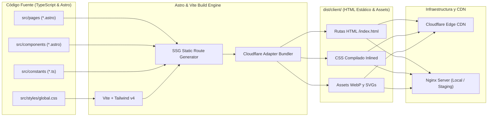
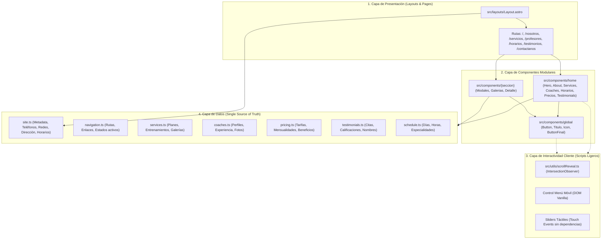

# Arquitectura del Sistema — Gym Tabaku

Documento técnico de arquitectura de software, infraestructura, flujo de datos y patrones de desarrollo del proyecto web de **Gym Tabaku** ([https://gymtabaku.com](https://gymtabaku.com)).

---

## 1. Resumen Ejecutivo y Objetivos Arquitectónicos

Gym Tabaku está construido bajo el paradigma de **Generación de Sitios Estáticos (SSG - Static Site Generation)** de alto rendimiento con **Astro**. El sistema está diseñado para cumplir con los siguientes pilares de calidad:

1. **Rendimiento Extremo (Web Vitals 90+)**: Cero JavaScript innecesario en tiempo de ejecución. Los componentes se renderizan como HTML puro durante la fase de compilación.
2. **SEO y Descubribilidad**: Arquitectura semántica estricta, Open Graph dinámico, Schema.org estructurado (`ExerciseGym`) y un único `<h1>` por ruta.
3. **Escalabilidad y Mantenibilidad**: Centralización de contenidos en constantes tipadas de TypeScript (*Single Source of Truth*), desacoplando los datos de la presentación visual.
4. **Resiliencia y Baja Latencia**: Despliegue en el *Edge* mediante Cloudflare Pages / Workers y servidor web Nginx para entrega ultrarrápida de activos estáticos.

---

## 2. Stack Tecnológico

| Capa | Tecnología | Versión / Detalle | Justificación |
| :--- | :--- | :--- | :--- |
| **Framework Web** | Astro | v5 / v7.2 | Generación de HTML estático sin sobrecarga de hidratación SPA |
| **Motor de Estilos** | Tailwind CSS | v4 (`@tailwindcss/vite`) | Compilación de CSS de alto rendimiento con tokens en `@theme` |
| **Empaquetador (Bundler)** | Vite | v6 integrado | Optimización de dependencias, hashing de assets y tree-shaking |
| **Tipado y Lógica** | TypeScript | v5 | Seguridad de tipos en contratos de datos y props de componentes |
| **Procesamiento de Imágenes** | Sharp | v0.34 | Compresión y generación de variantes WebP por breakpoints |
| **Tipografías Web** | Fontsource | `@fontsource/*` | Empaquetado local de fuentes (*self-hosted*), eliminando dependencias de Google Fonts |
| **Despliegue / Adapter** | Cloudflare Pages / Workers | `@astrojs/cloudflare` | Despliegue global en el Edge, caché inmutable y soporte de KV/Images |
| **Servidor Local / Proxy** | Nginx | HTTP Server en Windows | Servidor de archivos estáticos y entorno de staging local |

---

## 3. Diagramas de Arquitectura

### 3.1. Flujo de Compilación y Entrega (Build & Delivery Pipeline)



### 3.2. Arquitectura de Capas de la Aplicación



---

## 4. Estructura del Proyecto

```
gymtabaku/
├── .astro/                         # Caché temporal generada por Astro
├── dist/                           # Directorio de salida de producción compilado (SSG)
│   └── client/                     # Archivos estáticos finales generados por Astro
│       ├── _astro/                 # Bundles de assets versionados con hash
│       ├── contactanos/index.html  # Página Contacto
│       ├── horarios/index.html     # Página Horarios
│       ├── nosotros/index.html     # Página Sobre Nosotros
│       ├── profesores/index.html   # Página Entrenadores
│       ├── servicios/index.html    # Página Servicios
│       ├── testimonios/index.html  # Página Testimonios
│       └── index.html              # Página Principal (Home)
├── public/                         # Archivos estáticos servidos directamente en la raíz
│   ├── img/
│   │   ├── bg/                     # Fondos WebP optimizados (heeder, bgoscuro, bgclaro...)
│   │   ├── coach/                  # Fotografías de entrenadores
│   │   ├── colors/                 # Muestras y tiras gráficas de la paleta en SVG
│   │   ├── gallery/                # Imágenes de galerías de zonas y clases
│   │   ├── services/               # Portadas WebP y variantes responsivas (-sm, -md)
│   │   └── logo.webp               # Logotipo oficial optimizado (13.8 KB)
│   ├── robots.txt                  # Directivas para motores de búsqueda (Googlebot)
│   └── sitemap-index.xml           # Mapa de sitio XML para indexación SEO
├── scripts/                        # Scripts de automatización y mantenimiento en Node.js
│   ├── generate-responsive-images.mjs  # Generador de variantes WebP por breakpoints
│   └── generate-color-swatches.mjs     # Generador de activos visuales de color
├── src/                            # Código fuente de la aplicación
│   ├── components/                 # Componentes Astro reutilizables
│   │   ├── coach/                  # Componentes específicos de la vista /profesores
│   │   ├── constants/              # Contratos de datos tipados (site, coaches, pricing...)
│   │   ├── contactanos/            # Componentes específicos de la vista /contactanos
│   │   ├── global/                 # Componentes atómicos transversales (Button, Titulo...)
│   │   ├── home/                   # Secciones modulares de la página de inicio
│   │   ├── horarios/               # Componentes específicos de la vista /horarios
│   │   ├── nosotros/               # Componentes específicos de la vista /nosotros
│   │   ├── service/                # Componentes específicos de la vista /servicios
│   │   ├── testimonials/           # Componentes específicos de la vista /testimonios
│   │   ├── Footer.astro            # Pie de página institucional y datos de contacto
│   │   ├── Header.astro            # Hero principal y llamada a la acción
│   │   └── Menu.astro              # Barra de navegación adaptable (Desktop & Móvil)
│   ├── layouts/
│   │   └── Layout.astro            # Plantilla maestra (Head, Meta, Schema, Fuentes)
│   ├── pages/                      # Sistema de enrutamiento basado en archivos
│   │   ├── contactanos.astro       # Ruta /contactanos
│   │   ├── horarios.astro          # Ruta /horarios
│   │   ├── index.astro             # Ruta / (Home)
│   │   ├── nosotros.astro          # Ruta /nosotros
│   │   ├── profesores.astro        # Ruta /profesores
│   │   ├── servicios.astro         # Ruta /servicios
│   │   └── testimonios.astro       # Ruta /testimonios
│   ├── styles/
│   │   └── global.css              # Tokens @theme de Tailwind, animaciones y reset
│   └── utils/                      # Funciones utilitarias y scripts de cliente
│       ├── menu.ts                 # Lógica de detección de ruta activa en navegación
│       └── scrollReveal.ts         # Motor de animaciones con IntersectionObserver
├── astro.config.mjs                # Configuración principal de Astro y plugins Vite
├── design.md                       # Especificación del sistema de diseño y paleta visual
├── package.json                    # Dependencias y scripts de npm
├── tsconfig.json                   # Configuración del compilador TypeScript y alias (@/*)
└── wrangler.jsonc                  # Configuración de despliegue para Cloudflare
```

---

## 5. Patrones de Diseño y Decisiones Arquitectónicas

### 5.1. Island Architecture y Cero Sobrecarga de Hidratación
A diferencia de frameworks basados enteramente en SPA (React, Vue, Angular), Astro genera HTML estático por defecto. No se envía un framework cliente completo a los visitantes:
* **Interactividad sin dependencias**: El menú hamburguesa, el carrusel de coaches, el botón de retorno y el slider de testimonios están implementados con **TypeScript nativo puro**, escuchando eventos del DOM (`click`, `scroll`, `touchstart`, `touchend`).
* **Rendimiento de CPU móvil**: Se evita el tiempo de evaluación y parseo de JavaScript masivo en smartphones de gama media/baja, reduciendo a 0 ms el *Total Blocking Time (TBT)*.

### 5.2. Datos Tipados y Desacoplados (Single Source of Truth)
Toda la información del negocio reside en `src/components/constants/`:
* Si el teléfono de WhatsApp, los precios de los planes o los horarios festivos cambian, se modifican en un único archivo (`site.ts`, `pricing.ts`, etc.) y automáticamente se reflejan en la cabecera, pie de página, tarjetas de precios, mensajes de WhatsApp y en los datos estructurados Schema.org JSON-LD.

### 5.3. Sistema de Revelado por Scroll Acelerado por GPU
* La detección de visibilidad se delega al API nativo del navegador `IntersectionObserver` con un `rootMargin` calibrado (`0px 0px -25% 0px`), eliminando listeners pesados de scroll.
* Las transiciones operan exclusivamente sobre `opacity` y `transform: translate3d()`, asegurando renderizado fluido a 60 fps mediante composición en GPU.
* Se incluye prevención estricta de *Layout Thrashing* (reprocesamiento forzado), cacheando dimensiones geométricas en eventos `resize` pasivos en lugar de consultar `scrollHeight` o `offsetLeft` en cada frame.

### 5.4. Estrategia de Carga de Recursos (Performance First)
1. **Precarga Adaptativa de Imagen Hero (LCP)**:
   ```html
   <link rel="preload" as="image" href="/img/bg/heeder-mobile.webp" media="(max-width: 639px)" fetchpriority="high" />
   <link rel="preload" as="image" href="/img/bg/heeder.webp" media="(min-width: 640px)" fetchpriority="high" />
   ```
2. **Imágenes Responsivas por Breakpoints**:
   Las tarjetas de servicios y galerías sirven imágenes escalonadas (`-sm` a 360 px, `-md` a 480 px, y originales a 1000 px) mediante atributos `srcset` y `sizes`, reduciendo el payload de datos móviles en más de un 60%.
3. **Fuentes Auto-hospedadas (Self-Hosted)**:
   Se importan únicamente los subconjuntos latinos necesarios (`latin.css` y `wght.css`), eliminando los tiempos de conexión externa y resolución DNS hacia servidores de terceros.

---

## 6. Arquitectura de SEO y Accesibilidad (A11y)

### 6.1. Jerarquía Semántica de Landmarks
Todas las páginas respetan estrictamente la estructura estandarizada WAI-ARIA:
* `<header>` con `<nav>` para la navegación principal accesible mediante teclado.
* `<main id="main-content">` que engloba el contenido esencial único de la ruta.
* `<footer>` con rol semántico institucional.

### 6.2. Datos Estructurados JSON-LD
Cada página inyecta un bloque Schema.org con información enriquecida para Google:
```json
{
  "@context": "https://schema.org",
  "@type": "ExerciseGym",
  "name": "GYM TABAKU",
  "url": "https://gymtabaku.com",
  "logo": "https://gymtabaku.com/img/logo.webp",
  "telephone": "+573158361031",
  "address": {
    "@type": "PostalAddress",
    "streetAddress": "Cra. 82a #6-16, Kennedy",
    "addressLocality": "Bogotá",
    "addressRegion": "Cundinamarca",
    "addressCountry": "CO"
  },
  "geo": {
    "@type": "GeoCoordinates",
    "latitude": 4.6386711,
    "longitude": -74.1546467
  }
}
```

---

## 7. Entorno de Desarrollo y Despliegue

### Comandos de Operación

| Comando | Acción |
| :--- | :--- |
| `npm run dev` | Inicia el servidor de desarrollo local en `http://localhost:4321` |
| `astro dev --background` | Ejecuta el servidor de desarrollo en segundo plano gestionado por el entorno |
| `npm run build` | Compila la aplicación a HTML estático en `dist/client/` optimizado para Cloudflare |
| `npm run preview` | Previsualiza localmente los archivos compilados de producción |
| `npm run images:optimize` | Ejecuta el script Sharp para redimensionar y recomprimir imágenes WebP |
| `node scripts/generate-color-swatches.mjs` | Genera los activos SVG de la paleta de colores y muestras |
